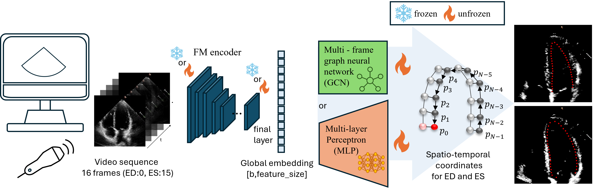

# EchoVLMLandmarks
**Spatio-Temporal Landmark Detection via Selective Fine-Tuning of Echocardiography Foundation Models (NLDL 2026)** 

This repository accompanies the paper:

> **Preetraj Bhoodoo**, Sarina Thomas, Elisabeth Wetzer, Anne Solberg, Guy Ben-Yosef.  
> *Spatio-Temporal Landmark Detection via Selective Fine-Tuning of Echocardiography Foundation Models.*  
> Proceedings of the 7th Northern Lights Deep Learning Conference (NLDL), PMLR 307, 2026. 

---

## Summary
We investigate whether modern **video-based echocardiography foundation models** can be adapted to **precise spatio-temporal landmark detection** (LV contour landmarks at **end-diastole (ED)** and **end-systole (ES)**) without extensive fine-tuning. We evaluate two strong encoders (**EchoPrime** and **PanEcho**) on **EchoNet-Dynamic**, and compare:
- **Encoder regimes:** frozen vs. selective unfreezing vs. full fine-tuning  
- **Decoder heads:** MLP vs. **graph-based (GCN)** decoding  
- **Baselines:** ResNet-18 (2D/3D), ViT-Base, MViTv2-Small

A key finding is that **selectively unfreezing only the last few blocks** can recover most of the performance of full fine-tuning, especially when paired with a **GCN head** and augmentation. 

---

## Main architecture
Below is the high-level pipeline (encoder + landmark decoder head) used in the paper.

> **Figure:** Overview of the experiment setup (sampled 16-frame clip from ED→ES → FM encoder → MLP/GCN → ED/ES landmarks).  



---

## Repository status (code release)
🚧 **Code is currently being prepared and will be released in this repository.**

If you need access urgently (e.g., replication, review, or follow-up work), please email:  
**preetrb@uio.no**  
to request access to the code repository / early release.

---

## Data
Experiments use **EchoNet-Dynamic** (apical-4-chamber echocardiography videos with ED/ES annotations).  
Please follow the dataset’s official access procedure and terms of use.

---

## Planned contents
This repository will include:
- Training and evaluation code (PyTorch)
- Model definitions (freezing regimes, adapters if used, MLP and GCN heads)
- Data preprocessing and augmentation pipeline
- Reproducibility scripts/configs for paper experiments on EchoNet-Dynamic
- Checkpointing and logging utilities (as permitted)

---

## License
- The paper is open-access under **CC BY 4.0**.
- Code licensing will be specified upon release.

---

## Citation
If you use this work, please cite:

```bibtex
@inproceedings{bhoodoo2026echovlmlandmarks,
  title     = {Spatio-Temporal Landmark Detection via Selective Fine-Tuning of Echocardiography Foundation Models},
  author    = {Bhoodoo, Preetraj and Thomas, Sarina and Wetzer, Elisabeth and Solberg, Anne and Ben-Yosef, Guy},
  booktitle = {Proceedings of the 7th Northern Lights Deep Learning Conference (NLDL)},
  series    = {Proceedings of Machine Learning Research (PMLR)},
  volume    = {307},
  year      = {2026}
}